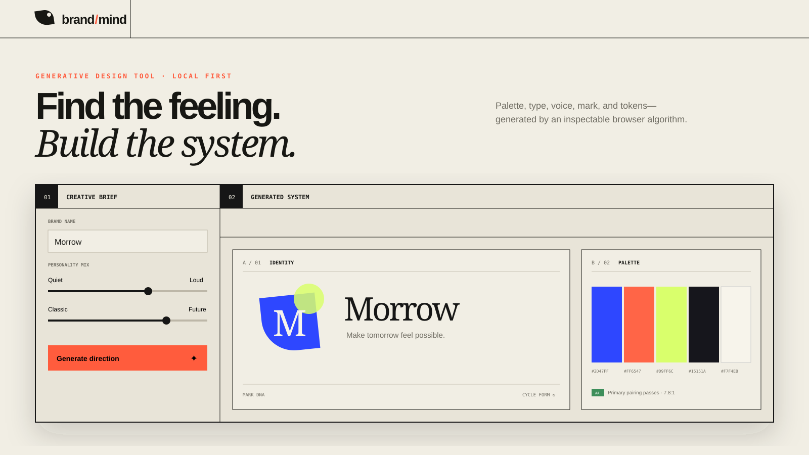
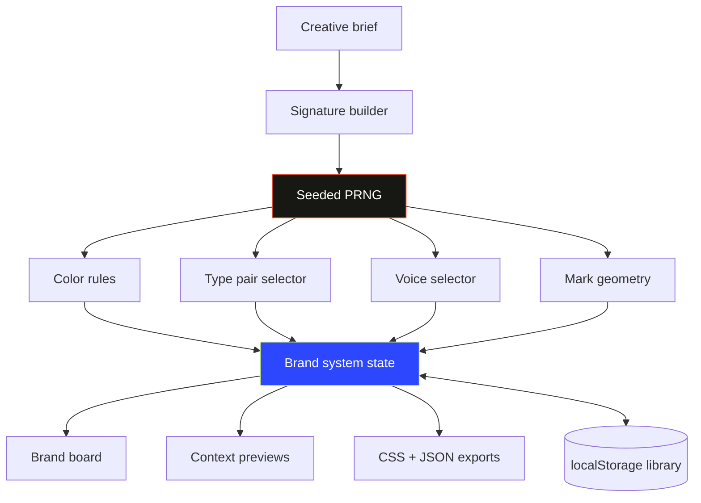

<div align="center">
  
  <br /><br />
  <h1>brand/mind</h1>
  <p><strong>Find the feeling. Build the system.</strong></p>
  <p>An editorial, local-first studio that turns a creative brief into an editable palette, type pairing, voice, mark, preview, and design tokens.</p>
  <p>
    
    
    
    
  </p>
</div>

> Brand Mind is **AI-inspired, not AI-powered**. It uses a seeded, inspectable JavaScript algorithm—never an LLM, image model, or remote service. The output is creative direction for exploration, not an automatically complete brand strategy.

## The problem

Early brand exploration falls into an awkward gap: moodboards are expressive but hard to translate, while design-token tools need decisions that do not exist yet. Brand Mind bridges that gap. A small brief becomes a coherent direction you can see in context, tune, save, and hand off as ordinary CSS or JSON.

## Highlights

- **Brief-led generation** across industry, archetype, audience, and three personality axes.
- **Seeded visual logic** that maps input signals to hue relationships, saturation, type, radii, mark geometry, and voice.
- **Five-color palette** with per-swatch locks and a WCAG contrast-ratio check for the primary pairing.
- **Curated system-font pairings** that work without font downloads or third-party services.
- **Voice direction** with traits, sample headline, preferred language, and language to avoid.
- **Three living previews**: a landing hero, a social tile, and a product card.
- **Portable tokens** as copyable/downloadable CSS plus a structured JSON brand-kit export.
- **Local favorites** that preserve complete directions in a browser-only library.
- **Responsive, accessible UI** with semantic controls, visible focus, keyboard-closeable drawers, and reduced-motion support.

## Architecture



The generator hashes the brief and current seed, then feeds that signature into a deterministic pseudo-random function. Rules turn those values into bounded creative decisions. The same saved state always renders the same system.

## Quick start

```bash
git clone https://github.com/harshareddy0405/brand-mind.git
cd 04-brand-mind
python3 -m http.server 8080
```

Visit [http://localhost:8080](http://localhost:8080). There is no package manager, environment file, API key, or compilation step.

## Usage

1. Name the brand, write a working tagline, and describe its audience.
2. Choose a world and archetype; tune the three personality sliders.
3. Select **Generate direction**. Generate again to explore a new seed without losing the brief.
4. Lock colors you want to keep, cycle the mark, and inspect the contrast note.
5. Use **In the wild** to test the direction across landing, social, and product contexts.
6. Open **Tokens** to copy or download CSS. Export the complete kit as JSON.
7. Save promising directions with the heart and restore them from the local library.

The ↻ button creates a complete surprise brief when you want a creative constraint instead of a blank page.

## Generation model

Brand Mind deliberately uses transparent design heuristics:

- Industry selects a starting hue family.
- Energy influences saturation and tonal contrast.
- Playfulness shifts accent relationships, lightness, and corner radii.
- Archetype selects a written voice family.
- A seeded choice selects one of several dependency-free type pairings.
- Mark variants combine the initial, primary color, highlight, radius, and rotation.

These are provocations, not universal branding truths. The interface keeps each outcome editable and exportable so a designer remains the decision-maker.

## Project structure

```text
04-brand-mind/
├── assets/
│   └── cover.svg       # Repository hero artwork
├── app.js              # Seeded generator, state, previews, exports
├── index.html          # Semantic studio interface
├── styles.css          # Editorial responsive system
├── README.md
├── LICENSE
└── .gitignore
```

## Local-first & privacy

- The generator runs entirely inside the current browser tab.
- Briefs and saved directions use `localStorage`; they are never uploaded.
- There are no analytics, trackers, model calls, remote fonts, or runtime dependencies.
- CSS and JSON downloads are created with browser `Blob` APIs.
- Clearing this site's browser storage removes saved directions, so export important work.

## Roadmap

- [ ] Direct color editing alongside lock controls
- [ ] Import and merge exported brand kits
- [ ] Additional editorial, packaging, and presentation previews
- [ ] Color-vision simulation and more accessibility pairings
- [ ] SVG mark export with geometry metadata
- [ ] User-authored archetype and voice-rule libraries

## Contributing

Contributions should preserve the project's local-first, dependency-free character. New generation rules should be bounded, explainable, and tested against extremely short, long, and non-English brand names. UI changes should remain keyboard-operable and usable at 320px wide.

1. Fork and create a descriptive branch.
2. Run the static site locally.
3. Exercise generation, color locks, every preview, saved-direction restore, and both exports.
4. Submit a pull request with before/after context and the rule or design rationale.

## License

Released under the [MIT License](LICENSE).

## Built to be inspected

[](https://github.com/harshareddy0405/brand-mind/actions/workflows/ci.yml)

The project includes versioned source, guarded local persistence, malformed-data recovery, product-specific interaction tests, and automated accessibility semantics checks. No API key is required to explore it.

```bash
# Optional development checks; the app itself needs no installation
npm ci --ignore-scripts
npm run check
npm test
npm run format:check
```

[Engineering notes](docs/ENGINEERING.md) · [Contributing](CONTRIBUTING.md) · [Security & privacy](SECURITY.md)

**Scope:** Generation is procedural, not a trained model. Font combinations use system stacks; brand uniqueness and trademark clearance are not evaluated.
